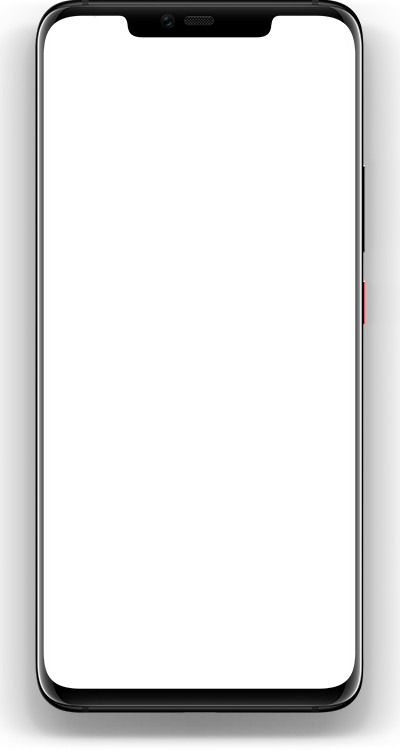

# Kamusi ya Kiswahili

Kiswahili Dictionary app made with Flutter.

## Screenshots
<table>
  <tr>
    <td>
        
    </td>
    <td>
        
    </td>
    <td>
        
    </td>
  </tr>
</table>
